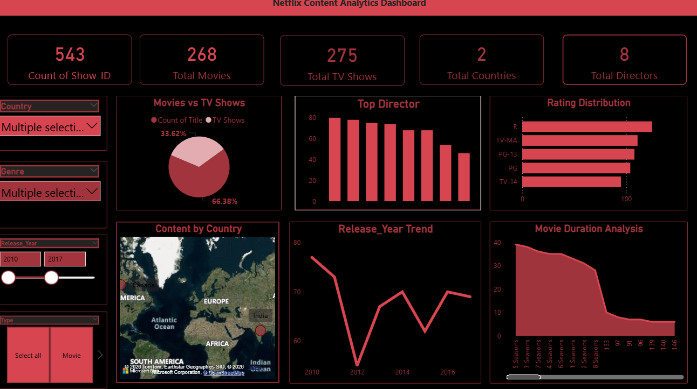

🎬 Netflix Content Analytics Dashboard (Power BI)
📌 Project Overview

This project presents an interactive Power BI dashboard built using the Netflix dataset.
The goal of this project is to analyze Netflix content including movies and TV shows to uncover insights related to ratings, directors, countries producing content, and release trends.

The dashboard provides a clear and interactive visualization of Netflix data, helping users understand content distribution and patterns across the platform.

🎯 Project Objectives

The main objectives of this project are:

• Analyze the number of Movies vs TV Shows available on Netflix
• Identify the most common content ratings
• Discover top directors creating Netflix content
• Analyze content distribution by country
• Understand release trends across different years
• Explore movie duration patterns

📊 Dashboard Features

This dashboard includes multiple visualizations to explore Netflix content data:

Key Metrics

Total Netflix Titles

Total Movies

Total TV Shows

Total Countries

Total Directors

Visualizations

Movies vs TV Shows Distribution

Top Directors Analysis

Rating Distribution

Content by Country (Map Visualization)

Release Year Trend

Movie Duration Analysis

These visuals help identify patterns and trends in Netflix content.

🗂 Dataset Information

The dataset used in this project contains information about Netflix titles including:

Show ID

Title

Director

Country

Genre / Category

Release Year

Rating

Duration

📥 Dataset Link

Dataset available in this repository:

Netflix_dataset.csv

Or open directly:

https://github.com/Nishahaldar/netflix-powerbi-dashboard/blob/main/Netflix_dataset.csv
🛠 Tools & Technologies Used
Tool	Purpose
Power BI	Data Visualization & Dashboard
CSV Dataset	Data Source
GitHub	Project Hosting
Data Analytics	Data exploration and insights
🖼 Dashboard Preview

Below is the preview of the Power BI dashboard:

This screenshot shows the interactive dashboard used to analyze Netflix data.

🚀 How to Use This Project

1️⃣ Download the Power BI (.pbix) file from this repository.

2️⃣ Open the file using Power BI Desktop.

3️⃣ Explore the interactive dashboard and visualizations.

📂 Repository Structure
netflix-powerbi-dashboard
│
├── Netflix_Dashboard.pbix
├── Netflix_Dashboard.png
├── Netflix_dataset.csv
└── README.md
📈 Key Insights from the Dashboard

• Netflix has more Movies compared to TV Shows

• Certain content ratings dominate the platform

• Content production is concentrated in a few major countries

• Some directors have produced multiple titles on Netflix

• The number of titles released has grown over time

👩‍💻 Author

Nisha Haldar

Aspiring Data Analyst passionate about learning:

Data Analytics

Power BI

SQL

Data Visualization

GitHub Profile:
https://github.com/Nishahaldar
